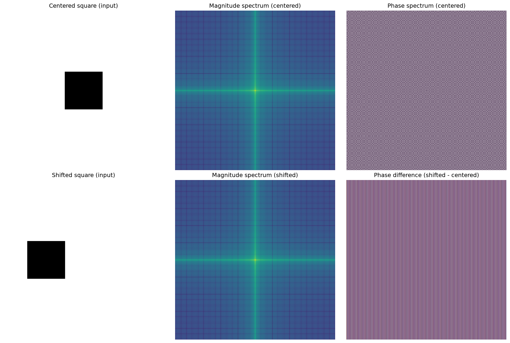

# Image_A — Fourier Shift Theorem Demonstration

This project contains a Jupyter Notebook (`Phase_Analysis.ipynb`) that demonstrates the
**Fourier Shift Theorem** using simple, procedurally generated images.

## What the Notebook Does

The notebook walks through the following steps:

1. **Configuration** — Defines the parameters used to generate the images
   (image size, square size, shift amount, and colors).

2. **Image Generation** — Uses [Pillow (PIL)](https://pillow.readthedocs.io/) to
   create two `512×512` white images, each containing a black square:
   - `square_centered.png` — a square centered in the image.
   - `square_left.png` — the same square shifted `120` pixels to the left.

3. **Image Preview** — Displays both generated images inline using
   `IPython.display`.

4. **Fourier Analysis** — Converts both images to grayscale, computes their
   2D Fast Fourier Transforms (FFT) with NumPy, and visualizes:
   - The **magnitude spectra** of both images.
   - The **phase spectra** and the **phase difference** between them.

5. **Saving Results** — Saves the Fourier analysis figure as
   `fourier_analysis.png`.



## Key Takeaway

The analysis confirms the **Fourier Shift Theorem**:

- The **magnitude spectrum is unchanged** by a spatial shift
  (max magnitude difference ≈ `0.0000`).
- The **phase spectrum changes** in proportion to the shift
  (mean absolute phase difference ≈ `1.5708` rad).

## Requirements

- Python 3.12+
- [NumPy](https://numpy.org/)
- [Pillow](https://pillow.readthedocs.io/)
- [Matplotlib](https://matplotlib.org/)
- [IPython / Jupyter](https://jupyter.org/)

Install the dependencies with:

```bash
pip install numpy pillow matplotlib jupyter
```